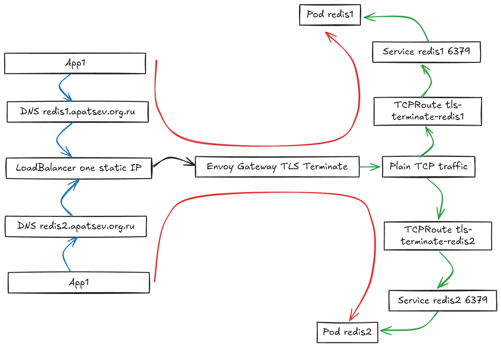

# Как маршрутизировать на разные Redis и другие сервисы через один LoadBalancer по SNI TCP routing используя Gateway API

**Цель статьи:** Показать на практическом примере, как использовать **один Load Balancer** для приёма TLS-соединений и маршрутизации бинарного трафика к **разным backend‑приложениям** с терминацией (расшифровкой) TLS на Gateway — например, к Redis и другим TCP‑сервисам.

**Как это работает:**
1. Клиент устанавливает TLS‑соединение с Gateway.
2. Gateway расшифровывает TLS (режим `Terminate`) трафик.
3. После расшифровки остаётся бинарный TCP‑трафик.
4. `TCPRoute` маршрутизирует расшифрованный TCP‑трафик к нужному backend‑сервису.
5. Backend‑сервис получает обычный TCP‑трафик без TLS.

### Предварительные требования

- Kubernetes‑кластер создан и доступен.
- `kubectl` настроен и подключён к кластеру.
- Helm установлен.
- DNS‑зона настроена (например, `apatsev.org.ru`).
- Выделен статический IP‑адрес для Envoy Gateway.
- Обе внешние DNS‑записи для Redis указывают на этот IP‑адрес.


### Схема маршрутизации трафика

- **Красная линия** — путь прохождения трафика от приложения до Redis.
- **Синяя линия** — зашифрованный трафик.
- **Зелёная линия** — незашифрованный трафик.



#### Маршрутизация по FQDN

**Важно:** В данной конфигурации каждый FQDN маршрутизируется строго на свой backend:
- Трафик с `redis1.apatsev.org.ru` идёт **только** на backend `redis1` (через `TCPRoute` с `sectionName: tls-terminate-redis1`).
- Трафик с `redis2.apatsev.org.ru` идёт **только** на backend `redis2` (через `TCPRoute` с `sectionName: tls-terminate-redis2`).

Маршрутизация определяется на уровне Gateway `listener`‑ов:
- `listener` `tls-terminate-redis1` с `hostname: "redis1.apatsev.org.ru"` → `TCPRoute` с `sectionName: tls-terminate-redis1` → backend `redis1`.
- `listener` `tls-terminate-redis2` с `hostname: "redis2.apatsev.org.ru"` → `TCPRoute` с `sectionName: tls-terminate-redis2` → backend `redis2`.

`TCPRoute` **не поддерживает** поле `hostnames`. Маршрутизация по `hostname` происходит на уровне Gateway `listener`‑а через `sectionName`, что обеспечивает строгую изоляцию трафика между разными FQDN.

### 1. Установка Envoy Gateway

Установка Envoy Gateway через Helm:

```bash
helm upgrade --install envoy-gateway oci://docker.io/envoyproxy/gateway-helm \
  --version v1.6.2 \
  -n envoy-gateway \
  --create-namespace \
  --wait
```

### 2. Применение EnvoyProxy конфигурации

После установки Envoy Gateway применяем EnvoyProxy ресурс для настройки LoadBalancer со статическим IP.

`kind: EnvoyProxy` нужен для настройки **общего “data-plane” прокси для нескольких Gateway** — в частности, включается `mergeGateways: true`, чтобы Envoy Gateway **сливал конфигурации нескольких Gateway в один общий Envoy** и, как следствие, держал **один Service типа LoadBalancer с одним статическим IP** (а значит и один входной адрес для нескольких FQDN/`listener`‑ов). Без EnvoyProxy вы обычно получите отдельный Service/LoadBalancer на каждый Gateway.


Создаём файл `envoyproxy.yaml`:

```yaml
apiVersion: gateway.envoyproxy.io/v1alpha1
kind: EnvoyProxy
metadata:
  name: merged-proxy
  namespace: envoy-gateway
spec:
  mergeGateways: true
  provider:
    type: Kubernetes
    kubernetes:
      envoyService:
        patch:
          type: StrategicMerge
          value:
            spec:
              type: LoadBalancer
              loadBalancerIP: <STATIC_IP> # IP, на который указывают обе внешние DNS‑записи Redis
```

Применяем:
```bash
kubectl apply -f envoyproxy.yaml
```

### 3. Генерация TLS сертификатов

Скрипт генерирует **Root CA** и **обычный (leaf) TLS‑сертификат**, подписанный этим Root CA.
Также он создаёт два секрета:
- `gateway-tls-cert` (тип `kubernetes.io/tls`) — ключ+сертификат для TLS Terminate (`Terminate`) на Gateway
- `gateway-root-ca` (тип `Opaque`) — `ca.crt` для клиентов (app1/app2)

Содержимое скрипта:

```bash
#!/bin/bash
set -e

echo "Генерация Root CA и TLS сертификата для Gateway..."

TMP_DIR="$(mktemp -d)"
trap 'rm -rf "$TMP_DIR"' EXIT

CA_KEY="/tmp/gateway-ca.key"
CA_CRT="/tmp/gateway-ca.crt"

TLS_KEY="/tmp/gateway-tls.key"
TLS_CSR="$TMP_DIR/gateway-tls.csr"
TLS_CRT_LEAF="/tmp/gateway-tls-leaf.crt"
TLS_CRT_CHAIN="/tmp/gateway-tls.crt"

DOMAIN="apatsev.org.ru"
WILDCARD="*.$DOMAIN"

# 1) Root CA (самоподписанный корневой сертификат)
openssl genrsa -out "$CA_KEY" 2048
openssl req -x509 -new -nodes -days 3650 -sha256 \
  -key "$CA_KEY" \
  -out "$CA_CRT" \
  -subj "/CN=Gateway Root CA ($DOMAIN)" \
  -addext "basicConstraints=critical,CA:TRUE,pathlen:0" \
  -addext "keyUsage=critical,keyCertSign,cRLSign" \
  -addext "subjectKeyIdentifier=hash"

# 2) Leaf сертификат для Gateway, подписанный Root CA
cat > "$TMP_DIR/leaf.cnf" <<EOF
[ req ]
default_bits       = 2048
prompt             = no
default_md         = sha256
distinguished_name = dn
req_extensions     = v3_req

[ dn ]
CN = $WILDCARD

[ v3_req ]
basicConstraints = critical,CA:FALSE
keyUsage = critical, digitalSignature, keyEncipherment
extendedKeyUsage = serverAuth
subjectAltName = @alt_names

[ alt_names ]
DNS.1 = $WILDCARD
DNS.2 = redis1.$DOMAIN
DNS.3 = redis2.$DOMAIN
EOF

openssl genrsa -out "$TLS_KEY" 2048
openssl req -new -key "$TLS_KEY" -out "$TLS_CSR" -config "$TMP_DIR/leaf.cnf"

openssl x509 -req -in "$TLS_CSR" -days 365 -sha256 \
  -CA "$CA_CRT" -CAkey "$CA_KEY" -CAcreateserial \
  -out "$TLS_CRT_LEAF" \
  -extfile "$TMP_DIR/leaf.cnf" -extensions v3_req

# 3) Цепочка (leaf + root CA) для отдачи клиентам при handshake (на всякий случай)
cat "$TLS_CRT_LEAF" "$CA_CRT" > "$TLS_CRT_CHAIN"

# 4) Secret для Gateway (TLS keypair)
kubectl create secret tls gateway-tls-cert \
  --cert="$TLS_CRT_CHAIN" \
  --key="$TLS_KEY" \
  --dry-run=client -o yaml | kubectl apply -f -

# 5) Secret с Root CA для клиентов (app1/app2)
kubectl create secret generic gateway-root-ca \
  --from-file=ca.crt="$CA_CRT" \
  --dry-run=client -o yaml | kubectl apply -f -

echo "Готово:"
echo "- Root CA: $CA_CRT"
echo "- Gateway TLS key: $TLS_KEY"
echo "- Gateway TLS cert chain: $TLS_CRT_CHAIN"
echo "- Secrets: gateway-tls-cert, gateway-root-ca применены в кластер."
```

Запуск:

```bash
./scripts/generate-tls-certs.sh
```

### 4. Создание GatewayClass

GatewayClass ссылается на EnvoyProxy конфигурацию через `parametersRef`:

Содержимое `manifests/gatewayclass.yaml`:

```yaml
apiVersion: gateway.networking.k8s.io/v1
kind: GatewayClass
metadata:
  name: envoy
spec:
  controllerName: gateway.envoyproxy.io/gatewayclass-controller
  parametersRef:
    group: gateway.envoyproxy.io
    kind: EnvoyProxy
    name: merged-proxy
    namespace: envoy-gateway
```

Применяем:
```bash
kubectl apply -f manifests/gatewayclass.yaml
```

Проверка статуса:

```bash
kubectl get gatewayclass envoy
```

**Ожидаемый результат:** GatewayClass создан со статусом `ACCEPTED: True`.

### 5. Развертывание ресурсов Gateway API

#### Создание Gateway‑ресурсов с TLS Terminate (`Terminate`)

**Важно:** Убедитесь, что GatewayClass `envoy` создан перед созданием Gateway ресурса.

Файл `manifests/gateway-redis1.yaml`:

```yaml
apiVersion: gateway.networking.k8s.io/v1
kind: Gateway
metadata:
  name: eg-redis1
  namespace: default
spec:
  gatewayClassName: envoy
  listeners:
  - name: tls-terminate-redis1
    protocol: TLS
    port: 443
    hostname: "redis1.apatsev.org.ru"
    tls:
      mode: Terminate
      certificateRefs:
      - name: gateway-tls-cert
        kind: Secret
    allowedRoutes:
      namespaces:
        from: All
```

Файл `manifests/gateway-redis2.yaml`:

```yaml
apiVersion: gateway.networking.k8s.io/v1
kind: Gateway
metadata:
  name: eg-redis2
  namespace: default
spec:
  gatewayClassName: envoy
  listeners:
  - name: tls-terminate-redis2
    protocol: TLS
    port: 443
    hostname: "redis2.apatsev.org.ru"
    tls:
      mode: Terminate
      certificateRefs:
      - name: gateway-tls-cert
        kind: Secret
    allowedRoutes:
      namespaces:
        from: All
```

**Важно:** Для маршрутизации по разным `hostname` нужны отдельные `listener`‑ы (по одному на `hostname`). Детали привязки `TCPRoute` к `listener`‑у (через `parentRefs[].sectionName`) и того, почему `TCPRoute` не ограничивается по `hostnames`, — в разделе **«Создание TCPRoute»** ниже.

Применение:

```bash
kubectl apply -f manifests/gateway-redis1.yaml
kubectl apply -f manifests/gateway-redis2.yaml

# Проверка статуса Gateway
kubectl get gateway eg-redis1 eg-redis2 -n default | grep -C 1 PROGRAMMED
kubectl describe gateway eg-redis1 -n default | grep -C 1 Accepted
kubectl describe gateway eg-redis2 -n default | grep -C 1 Accepted
```

**Ожидаемый результат:** Gateway‑ресурсы созданы, статус `PROGRAMMED: True` (в выводе `kubectl get`), условие `Accepted: True` (в условиях Gateway), адрес назначен (статический IP из Terraform).


#### Создание тестовых backend‑приложений (Redis 1 и Redis 2)

Redis выбран как наиболее простой вариант для тестирования:
- Легко развернуть
- Минимальные требования к ресурсам
- Простой бинарный протокол для тестирования
- Быстрая проверка работоспособности

Созданы два отдельных Redis backend‑а для демонстрации маршрутизации по `hostname`.

Файл `manifests/redis1-deployment.yaml`:

```yaml
---
apiVersion: apps/v1
kind: Deployment
metadata:
  name: redis1
  namespace: default
spec:
  replicas: 1
  selector:
    matchLabels:
      app: redis1
  template:
    metadata:
      labels:
        app: redis1
    spec:
      containers:
      - name: redis
        image: redis:7-alpine
        ports:
        - containerPort: 6379
          name: redis
        command:
        - redis-server
        - --port
        - "6379"

---
apiVersion: v1
kind: Service
metadata:
  name: redis1
  namespace: default
spec:
  ports:
  - name: redis
    port: 6379
    targetPort: 6379
    protocol: TCP
  selector:
    app: redis1
```

Файл `manifests/redis2-deployment.yaml` аналогичен, но использует `redis2` вместо `redis1`.

Применение манифестов:

```bash
kubectl apply -f manifests/redis1-deployment.yaml
kubectl apply -f manifests/redis2-deployment.yaml

# Проверка
kubectl get pods -l 'app in (redis1,redis2)'
kubectl get svc redis1 redis2
```

#### Создание TCPRoute

В режиме `tls.mode: Terminate` TLS завершается на уровне Gateway `listener`‑а (выбор `listener`‑а идёт по SNI/`hostname`), а `TCPRoute` маршрутизирует **уже расшифрованный** TCP‑трафик к backend.

**Важно:**
- `TCPRoute` **не поддерживает** поле `hostnames` — маршрутизация по `hostname` происходит на уровне Gateway `listener`‑а.
- Поэтому для каждого `hostname` нужен отдельный `listener` в Gateway, а соответствующий `TCPRoute` должен ссылаться на него через `parentRefs[].sectionName`.

Файл `manifests/redis1-tcproute.yaml`:

```yaml
apiVersion: gateway.networking.k8s.io/v1alpha2
kind: TCPRoute
metadata:
  name: redis1-tcproute
  namespace: default
spec:
  parentRefs:
  - name: eg-redis1
    namespace: default
    sectionName: tls-terminate-redis1
  rules:
  - backendRefs:
    - name: redis1
      port: 6379
      weight: 100
```

Файл `manifests/redis2-tcproute.yaml`:

```yaml
apiVersion: gateway.networking.k8s.io/v1alpha2
kind: TCPRoute
metadata:
  name: redis2-tcproute
  namespace: default
spec:
  parentRefs:
  - name: eg-redis2
    namespace: default
    sectionName: tls-terminate-redis2
  rules:
  - backendRefs:
    - name: redis2
      port: 6379
      weight: 100
```

**Примечание:** `parentRefs[].sectionName` должен совпадать с именем `listener`‑а в Gateway (`tls-terminate-redis1` или `tls-terminate-redis2`).

Применение:

```bash
kubectl apply -f manifests/redis1-tcproute.yaml
kubectl apply -f manifests/redis2-tcproute.yaml

# Проверка статуса
kubectl get tcproute redis1-tcproute redis2-tcproute -n default
kubectl describe tcproute redis1-tcproute -n default
kubectl describe tcproute redis2-tcproute -n default
```

**Ожидаемый результат:** `TCPRoute`‑ресурсы созданы, статус `Accepted: True`, привязаны к Gateway.

#### Тестирование TLS‑соединения (через openssl)

```bash
# Получение IP‑адреса (из Gateway status)
GATEWAY_IP=$(kubectl get gateway eg-redis1 -n default -o jsonpath='{.status.addresses[0].value}')

# Тест 1: TLS handshake + SNI (сертификат отдаётся Gateway, TLS терминируется на Gateway)
openssl s_client -connect $GATEWAY_IP:443 \
  -servername redis1.apatsev.org.ru \
  -showcerts

# Тест 2: Redis 1 через TLS терминацию на Gateway (отправляем Redis RESP поверх TLS до Gateway)
(echo -e "PING\r\n"; sleep 1) | openssl s_client -connect $GATEWAY_IP:443 \
  -servername redis1.apatsev.org.ru \
  -CAfile /tmp/gateway-ca.crt \
  -quiet 2>/dev/null

# Тест 3: Redis 2 через TLS терминацию на Gateway
(echo -e "PING\r\n"; sleep 1) | openssl s_client -connect $GATEWAY_IP:443 \
  -servername redis2.apatsev.org.ru \
  -CAfile /tmp/gateway-ca.crt \
  -quiet 2>/dev/null

# Ожидаемый ответ: +PONG (Redis протокол)
# Если получен ответ PONG, это подтверждает:
# - TLS расшифровывается на Gateway
# - SNI `hostname` правильно извлекается
# - `TCPRoute` маршрутизирует трафик к правильному Redis backend на основе `hostname`
# - Redis отвечает на запросы
```

**Ожидаемый результат:**
- TLS handshake успешен
- SNI правильно передаётся и используется для маршрутизации
- Трафик расшифровывается на Gateway
- Бинарный трафик маршрутизируется к соответствующему Redis backend на основе `hostname`
- Redis 1 и Redis 2 отвечают на запросы при использовании соответствующих `hostname`

### Тестирование через Go‑приложение

main.go:
```
package main

import (
	"context"
	"crypto/tls"
	"crypto/x509"
	"fmt"
	"net"
	"os"
	"path/filepath"
	"time"

	"github.com/redis/go-redis/v9"
)

func main() {
	// Получение адреса Redis из переменной окружения
	redisHost := os.Getenv("REDIS_HOST")
	if redisHost == "" {
		fmt.Fprintln(os.Stderr, "REDIS_HOST не установлен")
		os.Exit(1)
	}

	redisPort := os.Getenv("REDIS_PORT")
	if redisPort == "" {
		redisPort = "443"
	}

	redisAddr := fmt.Sprintf("%s:%s", redisHost, redisPort)

	fmt.Printf("Подключение к Redis через Gateway: %s\n", redisAddr)

	// Проверка DNS разрешения
	fmt.Printf("Проверка DNS для %s...\n", redisHost)
	ips, err := net.LookupHost(redisHost)
	if err != nil {
		fmt.Fprintf(os.Stderr, "Ошибка DNS разрешения: %v\n", err)
		os.Exit(1)
	}
	fmt.Printf("DNS разрешен: %v\n", ips)

	// TLS конфигурация: по умолчанию проверяем сертификат через Root CA,
	// который передается в контейнер через k8s Secret.
	//
	// - REDIS_CA_CERT: путь к ca.crt (по умолчанию /etc/redis-ca/ca.crt)
	// - REDIS_INSECURE_SKIP_VERIFY=true: отключить проверку (не рекомендуется)
	caPath := os.Getenv("REDIS_CA_CERT")
	if caPath == "" {
		caPath = "/etc/redis-ca/ca.crt"
	}

	insecure := os.Getenv("REDIS_INSECURE_SKIP_VERIFY") == "true"

	tlsCfg := &tls.Config{
		MinVersion: tls.VersionTLS12,
		ServerName: redisHost,
	}

	if insecure {
		tlsCfg.InsecureSkipVerify = true
		fmt.Fprintln(os.Stderr, "Внимание: включен REDIS_INSECURE_SKIP_VERIFY=true (проверка TLS отключена)")
	} else {
		caBytes, err := os.ReadFile(filepath.Clean(caPath))
		if err != nil {
			fmt.Fprintf(os.Stderr, "Не удалось прочитать CA сертификат (%s): %v\n", caPath, err)
			fmt.Fprintln(os.Stderr, "Смонтируйте Secret с ca.crt или установите REDIS_INSECURE_SKIP_VERIFY=true")
			os.Exit(1)
		}
		pool := x509.NewCertPool()
		if ok := pool.AppendCertsFromPEM(caBytes); !ok {
			fmt.Fprintf(os.Stderr, "Не удалось распарсить CA сертификат (%s)\n", caPath)
			os.Exit(1)
		}
		tlsCfg.RootCAs = pool
	}

	// Настройка Redis клиента с TLS
	rdb := redis.NewClient(&redis.Options{
		Addr: redisAddr,
		TLSConfig: &tls.Config{
			MinVersion:         tlsCfg.MinVersion,
			ServerName:         tlsCfg.ServerName,
			RootCAs:            tlsCfg.RootCAs,
			InsecureSkipVerify: tlsCfg.InsecureSkipVerify,
		},
		DialTimeout:  5 * time.Second,
		ReadTimeout:  3 * time.Second,
		WriteTimeout: 3 * time.Second,
	})
	defer rdb.Close()

	// Контекст с таймаутом для всех операций
	ctx, cancel := context.WithTimeout(context.Background(), 10*time.Second)
	defer cancel()

	// Получение аргументов командной строки
	if len(os.Args) > 1 {
		// Проверка подключения с выводом статуса
		fmt.Println("Проверка подключения к Redis...")
		_, err := rdb.Ping(ctx).Result()
		if err != nil {
			fmt.Fprintf(os.Stderr, "Ошибка подключения к Redis: %v\n", err)
			os.Exit(1)
		}
		fmt.Println("Подключение успешно!")
		// Выполнение команды Redis
		cmd := os.Args[1]
		args := os.Args[2:]

		var result interface{}

		switch cmd {
		case "PING":
			result, err = rdb.Ping(ctx).Result()
		case "SET":
			if len(args) < 2 {
				fmt.Println("Использование: SET <key> <value>")
				os.Exit(1)
			}
			err = rdb.Set(ctx, args[0], args[1], 0).Err()
			if err == nil {
				result = "OK"
			}
		case "GET":
			if len(args) < 1 {
				fmt.Println("Использование: GET <key>")
				os.Exit(1)
			}
			result, err = rdb.Get(ctx, args[0]).Result()
		case "DEL":
			if len(args) < 1 {
				fmt.Println("Использование: DEL <key>")
				os.Exit(1)
			}
			result, err = rdb.Del(ctx, args...).Result()
		case "KEYS":
			pattern := "*"
			if len(args) > 0 {
				pattern = args[0]
			}
			result, err = rdb.Keys(ctx, pattern).Result()
		case "FLUSHDB":
			err = rdb.FlushDB(ctx).Err()
			if err == nil {
				result = "OK"
			}
		default:
			fmt.Fprintf(os.Stderr, "Неизвестная команда: %s\n", cmd)
			fmt.Println("Поддерживаемые команды: PING, SET, GET, DEL, KEYS, FLUSHDB")
			os.Exit(1)
		}

		if err != nil {
			fmt.Fprintf(os.Stderr, "Ошибка выполнения команды: %v\n", err)
			os.Exit(1)
		}

		fmt.Println(result)
	} else {
		// Интерактивный режим (простой)
		fmt.Println("Интерактивный режим. Для выхода используйте Ctrl+C")
		fmt.Println("Примеры команд:")
		fmt.Println("  SET key value")
		fmt.Println("  GET key")
		fmt.Println("  DEL key")
		fmt.Println("  KEYS *")

		// Простой цикл для выполнения команд
		for {
			var input string
			fmt.Print("redis> ")
			fmt.Scanln(&input)

			if input == "quit" || input == "exit" {
				break
			}
		}
	}
}
```

go.mod:
```
module redis-client

go 1.21

require github.com/redis/go-redis/v9 v9.7.0

require (
	github.com/cespare/xxhash/v2 v2.2.0 // indirect
	github.com/dgryski/go-rendezvous v0.0.0-20200823014737-9f7001d12a5f // indirect
)
```

go.sum
```
github.com/bsm/ginkgo/v2 v2.12.0 h1:Ny8MWAHyOepLGlLKYmXG4IEkioBysk6GpaRTLC8zwWs=
github.com/bsm/ginkgo/v2 v2.12.0/go.mod h1:SwYbGRRDovPVboqFv0tPTcG1sN61LM1Z4ARdbAV9g4c=
github.com/bsm/gomega v1.27.10 h1:yeMWxP2pV2fG3FgAODIY8EiRE3dy0aeFYt4l7wh6yKA=
github.com/bsm/gomega v1.27.10/go.mod h1:JyEr/xRbxbtgWNi8tIEVPUYZ5Dzef52k01W3YH0H+O0=
github.com/cespare/xxhash/v2 v2.2.0 h1:DC2CZ1Ep5Y4k3ZQ899DldepgrayRUGE6BBZ/cd9Cj44=
github.com/cespare/xxhash/v2 v2.2.0/go.mod h1:VGX0DQ3Q6kWi7AoAeZDth3/j3BFtOZR5XLFGgcrjCOs=
github.com/dgryski/go-rendezvous v0.0.0-20200823014737-9f7001d12a5f h1:lO4WD4F/rVNCu3HqELle0jiPLLBs70cWOduZpkS1E78=
github.com/dgryski/go-rendezvous v0.0.0-20200823014737-9f7001d12a5f/go.mod h1:cuUVRXasLTGF7a8hSLbxyZXjz+1KgoB3wDUb6vlszIc=
github.com/redis/go-redis/v9 v9.7.0 h1:HhLSs+B6O021gwzl+locl0zEDnyNkxMtf/Z3NNBMa9E=
github.com/redis/go-redis/v9 v9.7.0/go.mod h1:f6zhXITC7JUJIlPEiBOTXxJgPLdZcA93GewI7inzyWw=
```

Dockerfile:
```
# Многостадийная сборка
FROM golang:1.21-alpine AS builder

# Установка необходимых инструментов
RUN apk add --no-cache git ca-certificates tzdata

WORKDIR /build

# Копирование go.mod и go.sum (если есть)
COPY go.mod go.sum* ./

# Загрузка зависимостей
RUN go mod download

# Копирование исходного кода
COPY main.go .

# Обновление зависимостей после копирования кода
RUN go mod tidy

# Сборка приложения
RUN CGO_ENABLED=0 GOOS=linux go build -a -installsuffix cgo -o redis-client main.go

# Финальный образ
FROM alpine:latest

# Установка CA сертификатов для TLS
RUN apk --no-cache add ca-certificates

WORKDIR /app

# Копирование бинарника из builder
COPY --from=builder /build/redis-client .

# Переменная окружения для выбора Redis хоста
# REDIS_HOST может быть redis1.apatsev.org.ru или redis2.apatsev.org.ru или любой другой
ENV REDIS_HOST=redis1.apatsev.org.ru
ENV REDIS_PORT=443

# Исполняемый файл
ENTRYPOINT ["/app/redis-client"]
CMD []
```

Для тестирования используется готовый Docker‑образ `ghcr.io/patsevanton/gateway-api-tcproute-redis:1.0.0`.

### Установка `app1`/`app2` (клиенты) с Root CA из Kubernetes Secret

`app1` и `app2` подключаются к Redis через TLS (до Gateway) и **проверяют сертификат** по Root CA из Kubernetes Secret `gateway-root-ca` (ключ `ca.crt`).

Secret `gateway-root-ca` создаётся на шаге **«Генерация TLS‑сертификатов»** командой `./scripts/generate-tls-certs.sh`.

Если Root CA уже есть и нужно создать Secret вручную:

```bash
kubectl create secret generic gateway-root-ca \
  --from-file=ca.crt=/path/to/ca.crt \
  --dry-run=client -o yaml | kubectl apply -f -
```

### Запись данных в Redis

Запись в `redis1.apatsev.org.ru`:
```bash
kubectl delete pod redis1-test --ignore-not-found

cat <<'EOF' | kubectl apply -f -
apiVersion: v1
kind: Pod
metadata:
  name: redis1-test
spec:
  restartPolicy: Never
  volumes:
    - name: gateway-root-ca
      secret:
        secretName: gateway-root-ca
        items:
          - key: ca.crt
            path: ca.crt
  containers:
    - name: redis1-test
      image: ghcr.io/patsevanton/gateway-api-tcproute-redis:1.0.0
      env:
        - name: REDIS_HOST
          value: redis1.apatsev.org.ru
        - name: REDIS_CA_CERT
          value: /etc/redis-ca/ca.crt
      volumeMounts:
        - name: gateway-root-ca
          mountPath: /etc/redis-ca
          readOnly: true
      args: ["SET", "redis1key", "redis1"]
EOF

sleep 5
kubectl logs -f pod/redis1-test
kubectl delete pod redis1-test --wait=false
```

В выводе будет надпись
```
Подключение успешно!
```

Запись в `redis2.apatsev.org.ru`:
```bash
kubectl delete pod redis2-test --ignore-not-found

cat <<'EOF' | kubectl apply -f -
apiVersion: v1
kind: Pod
metadata:
  name: redis2-test
spec:
  restartPolicy: Never
  volumes:
    - name: gateway-root-ca
      secret:
        secretName: gateway-root-ca
        items:
          - key: ca.crt
            path: ca.crt
  containers:
    - name: redis2-test
      image: ghcr.io/patsevanton/gateway-api-tcproute-redis:1.0.0
      env:
        - name: REDIS_HOST
          value: redis2.apatsev.org.ru
        - name: REDIS_CA_CERT
          value: /etc/redis-ca/ca.crt
      volumeMounts:
        - name: gateway-root-ca
          mountPath: /etc/redis-ca
          readOnly: true
      args: ["SET", "redis2key", "redis2"]
EOF

sleep 5
kubectl logs -f pod/redis2-test
kubectl delete pod redis2-test --wait=false
```

В выводе будет надпись
```
Подключение успешно!
```

### Чтение данных из Redis
Чтение всех ключей из `redis1.apatsev.org.ru`:
```bash
kubectl delete pod redis1-test --ignore-not-found

cat <<'EOF' | kubectl apply -f -
apiVersion: v1
kind: Pod
metadata:
  name: redis1-test
spec:
  restartPolicy: Never
  volumes:
    - name: gateway-root-ca
      secret:
        secretName: gateway-root-ca
        items:
          - key: ca.crt
            path: ca.crt
  containers:
    - name: redis1-test
      image: ghcr.io/patsevanton/gateway-api-tcproute-redis:1.0.0
      env:
        - name: REDIS_HOST
          value: redis1.apatsev.org.ru
        - name: REDIS_CA_CERT
          value: /etc/redis-ca/ca.crt
      volumeMounts:
        - name: gateway-root-ca
          mountPath: /etc/redis-ca
          readOnly: true
      args: ["KEYS", "*"]
EOF

sleep 5
kubectl logs -f pod/redis1-test
kubectl delete pod redis1-test --wait=false
```

В выводе будет надпись
```
Подключение успешно!
[redis1key]
```

Чтение всех ключей из `redis2.apatsev.org.ru`:
```bash
kubectl delete pod redis2-test --ignore-not-found

cat <<'EOF' | kubectl apply -f -
apiVersion: v1
kind: Pod
metadata:
  name: redis2-test
spec:
  restartPolicy: Never
  volumes:
    - name: gateway-root-ca
      secret:
        secretName: gateway-root-ca
        items:
          - key: ca.crt
            path: ca.crt
  containers:
    - name: redis2-test
      image: ghcr.io/patsevanton/gateway-api-tcproute-redis:1.0.0
      env:
        - name: REDIS_HOST
          value: redis2.apatsev.org.ru
        - name: REDIS_CA_CERT
          value: /etc/redis-ca/ca.crt
      volumeMounts:
        - name: gateway-root-ca
          mountPath: /etc/redis-ca
          readOnly: true
      args: ["KEYS", "*"]
EOF

sleep 5
kubectl logs -f pod/redis2-test
kubectl delete pod redis2-test --wait=false
```

В выводе будет надпись
```
Подключение успешно!
[redis2key]
```

### Удаление всех ключей из Redis
Удаление всех ключей из `redis1.apatsev.org.ru`:
```bash
kubectl delete pod redis1-test --ignore-not-found

cat <<'EOF' | kubectl apply -f -
apiVersion: v1
kind: Pod
metadata:
  name: redis1-test
spec:
  restartPolicy: Never
  volumes:
    - name: gateway-root-ca
      secret:
        secretName: gateway-root-ca
        items:
          - key: ca.crt
            path: ca.crt
  containers:
    - name: redis1-test
      image: ghcr.io/patsevanton/gateway-api-tcproute-redis:1.0.0
      env:
        - name: REDIS_HOST
          value: redis1.apatsev.org.ru
        - name: REDIS_CA_CERT
          value: /etc/redis-ca/ca.crt
      volumeMounts:
        - name: gateway-root-ca
          mountPath: /etc/redis-ca
          readOnly: true
      args: ["FLUSHDB"]
EOF

sleep 5
kubectl logs -f pod/redis1-test
kubectl delete pod redis1-test --wait=false
```

Удаление всех ключей из `redis2.apatsev.org.ru`:
```bash
kubectl delete pod redis2-test --ignore-not-found

cat <<'EOF' | kubectl apply -f -
apiVersion: v1
kind: Pod
metadata:
  name: redis2-test
spec:
  restartPolicy: Never
  volumes:
    - name: gateway-root-ca
      secret:
        secretName: gateway-root-ca
        items:
          - key: ca.crt
            path: ca.crt
  containers:
    - name: redis2-test
      image: ghcr.io/patsevanton/gateway-api-tcproute-redis:1.0.0
      env:
        - name: REDIS_HOST
          value: redis2.apatsev.org.ru
        - name: REDIS_CA_CERT
          value: /etc/redis-ca/ca.crt
      volumeMounts:
        - name: gateway-root-ca
          mountPath: /etc/redis-ca
          readOnly: true
      args: ["FLUSHDB"]
EOF

sleep 5
kubectl logs -f pod/redis2-test
kubectl delete pod redis2-test --wait=false
```

## Полезные ссылки

- [Gateway API TCPRoute Spec](https://gateway-api.sigs.k8s.io/reference/spec/#gateway.networking.k8s.io/v1alpha2.TCPRoute)
- [Envoy Gateway Documentation](https://gateway.envoyproxy.io/)
- [Envoy Gateway EnvoyProxy API](https://gateway.envoyproxy.io/latest/api/extension_types/#envoyproxy)
- [Envoy Gateway Helm Chart](https://github.com/envoyproxy/gateway/tree/main/charts/gateway-helm)
